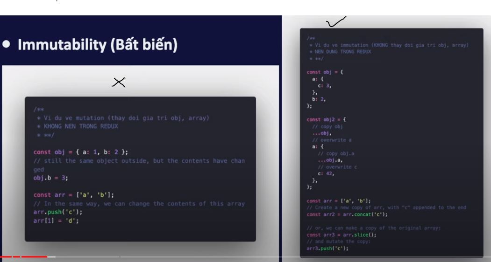

## Redux là gì
- là một thư viện js dùng để quản lý và cập nhật state của ứng dụng.
- là 1 pattern (khuôn mẫu)

## vì sao phải sử dụng redux? và redux tookit nói riêng
- quản lý Global state
    - các component tại mọi nơi trong ứng dụng có thể truy xuất và cập nhật
    - giải quyết vấn đề của React khi muốn truyền dữ liệu vào các cấp con cháu
- dễ dàng debug
- xử lý caching dữ liệu trên server

### vì sao phải sử dụng redux toolkit?
- sinh ra để giải quyết các vấn đề đối với `Redux Core`
    - việc cấu hình (config) Redux phức tạp
    - phải cài đặt thủ công nhiều packages để redux có thể hoạt động hiệu quả
    - redux yêu cầu rất nhiều boilerplate code

## khi nào nên sử dụng redux
Redux sẽ rất hữu dụng đối với các trường hợp sau đây:
- dự án có số lượng lớn state và các state được sử dụng ở nhiều nơi
- state được cập nhật thường xuyên
- logic code cập nhật state phức tạp
- ứng dụng có số lượng code trung bình hoặc lớn và có nhiều người làm chung
- cần debug và muốn xem cách state được cập nhật tại bất kỳ khoảng thời gian nào.

`NOTE: không phải lúc nào chúng ta cũng sử dụng Redux`

## kiến trúc của Redux và các khái niệm cần nắm
- State Management
- Immutability (bất biến)


## khi nào cần sử dụng redux
1. dữ liệu được sử dụng nhiều nơi
2. có hỗ trợ chức năng undo/redo
3 cần cache dữ liệu để tái sử dụng cho những lần sau

`NOTE: nếu app đang chạy tốt mà hông có redux, vậy có thể app đó không cần tới redux`

1. redux sử dụng kiến trúc 1 chiều: uni-directional data flow
2. redux chỉ dùng 1 store duy nhất làm single source of truth
3. redux state là READ-ONLY. muốn update phải dispatch 1 action (js object)
4. những thay đổi của redux state được thực hiện bởi Pure functions (reducer)
5. redux có thể dùng cho các js apps, không chỉ riêng gì ReactJS

## redux có thể dùng cho
1. reactjs
2. angular
3. vuejs
4. pure javascript app
5. orhter javascript app

## redux toolkit

## redux-thunk
- Dùng để xử lý side-effect và các hoạt động không đồng bộ (asynchronous)

### side-effect
- là những tương tác của ứng dụng với thế giới bên ngoài: giao tiếp API, đọc ghi file, analyst events
- trong redux: side-effect thường được xử lý ở action (action creator) hoặc middleware
- lưu ý: không xử lý ở reducers, vì reducer phải là pure function - hàm thuần thúy
```
Tóm lại: 
 - Action creator hoặc middleware đều có thể xử lý side-effect
 - Redux-thunk là một package. Cung cấp middleware để xử lý các hàm trả về từ action creator. Middleware và action creator làm việc cùng nhau.
```

apply:
- thường sử dụng để thực hiện gọi AJAX (call api). Dispatch một action sau khi gọi API thành công, hoặc dispatch một action trong quá trình call api (vd: hiển thị thanh tiến trình)
- sau đó sẽ đến store. Đảm bảo đến store phải là 1 action
- thực hiện asynchronous, thay vì action creator trả về một action, ta sẽ trả về 1 hàm (hàm ẩn danh - hay còn gọi là thunk). Middleware thunk cung cấp 2 đối số disppatch và getState
- thực hiện call api, fetch danh sách công việc bao gồm hiển thị loading, fetch thành công, fetch thất bại

## redux-saga
- xử lý side-effect
- xử lý tính năng ES6: generators
- xử lý các câu chuyện phức tạp về dữ liệu ()
- có khả năng chuyển code không đồng bộ thành đồng bộ
vd: Tính thời gian bắt đầu công việc
    - khi 1 công việc chuyển status là IN_PROGRESS ta tiến hành bắt đầu đếm giờ cho task đó
    - vậy sẽ có nhiều công việc được bắt đầu tính giờ nếu ta chuyển sang IN_PROGRESS
    - nếu công việc được chuyển là FINISH hoặc quay về trạng thái ban đầu thì ta dừng thời gian lại

## todo app bằng
1. React + redux core
2. react + redux toolkit

```
- kiến thức cần nắm
    - HTML & CSS
    - cú pháp và tính năng ES6
    - kiến thức về React: Props, state, function component, react hooks,...
    - bất đồng bộ trong javascript (async trong js)
- redux là 1 PATTERN
```